# 人の問題解決プロセスの分析手法をコンピューターに適用する試み #

### 著者{.author}

山口 琢(フリーランス)

大場 みち子(京都橘大学)

### 版{.version .current}

#### 版名{.version-name}

v1.1

#### 日付{.date}

2025-03-24

### 版{.version}

#### 版名{.version-name}

v1

#### 日付{.date}

2025-03-17

## はじめに

人の問題解決プロセス(特に読み書き)を測定・分析する研究をしてます:
- プロセスをデータ化/測定する手法: デジタル教材など
- 測定データを分析・評価する手法

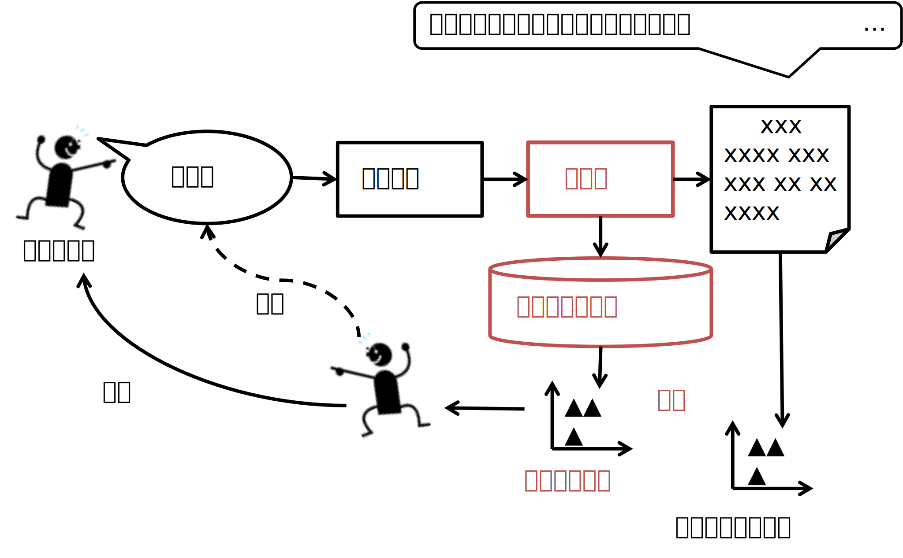{.fig-process style="inline-size: 17rem;"}

以下は、研究会の趣旨に合っているでしょうか？…

## プロセスの研究の進み方

プログラミングのプロセスを評価したい。

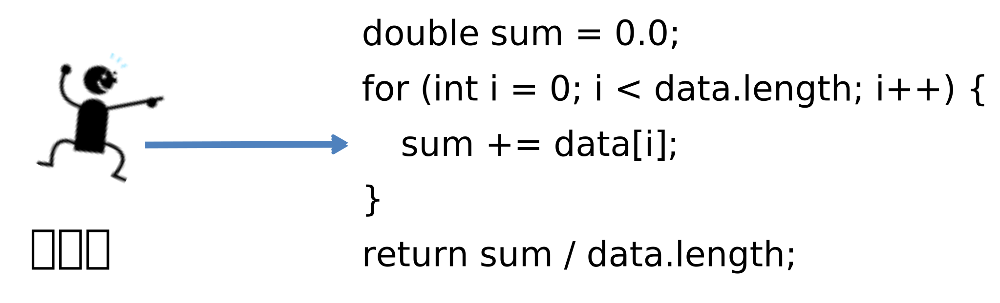{.fig-process}

### プロセスの研究

プログラミングのアプリを工夫してプロセスをデータ化

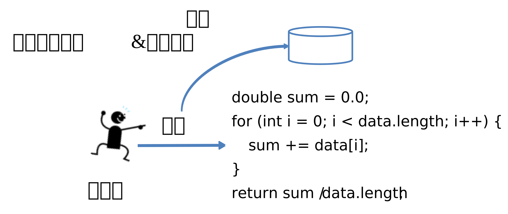{.fig-process}

### プロセスの研究

測定データを分析して推定する。

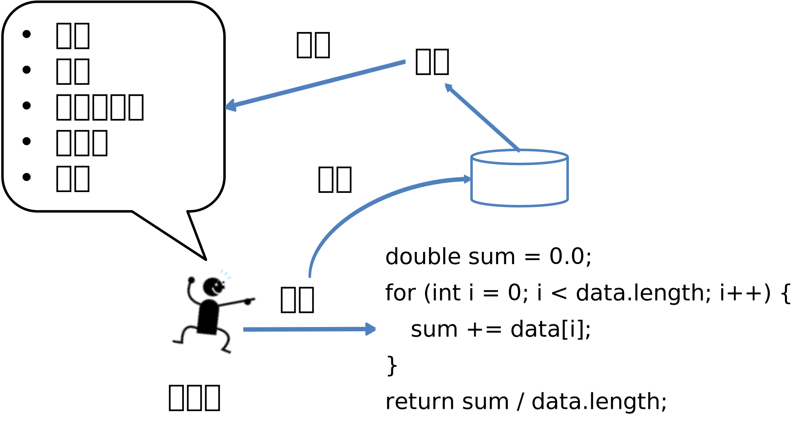{.fig-process}

### プロセスの研究

測定、分析、推定を評価

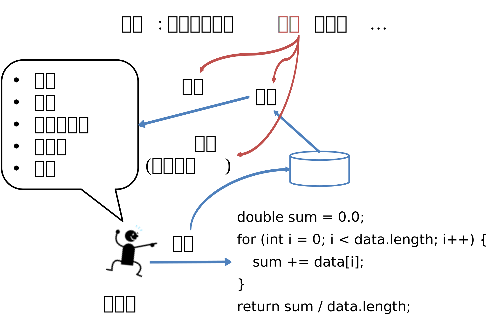{.fig-process}

### プロセスの研究

頭の中と答え合わせしたいが、できないので…

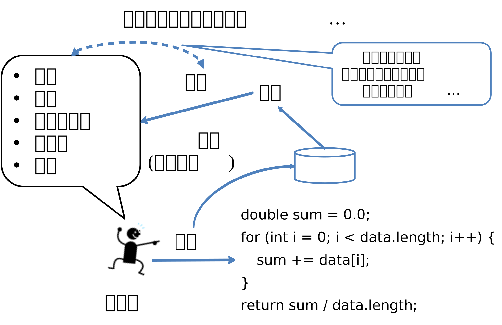{.fig-process}

### プロセスの研究

他のデータと答え合わせする。

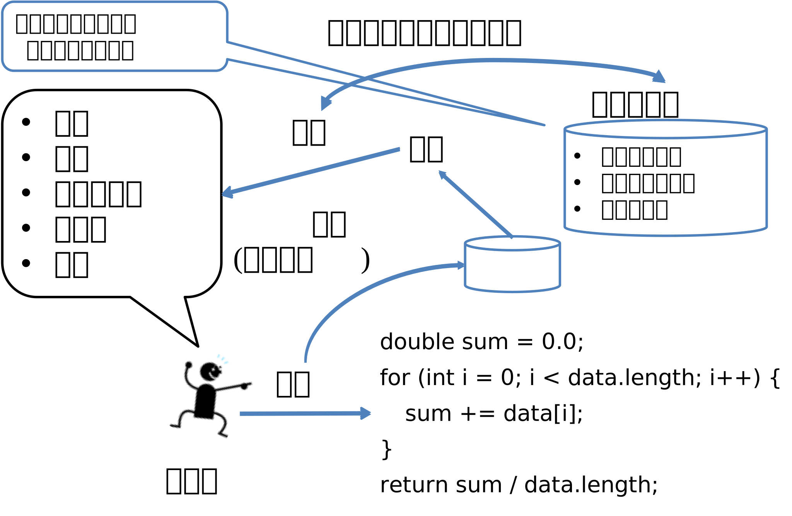{.fig-process}

## 今日のお題

アルゴリズムが分かっているコンピューターによる問題解決プロセスならば、直接答え合わせできるだろう。

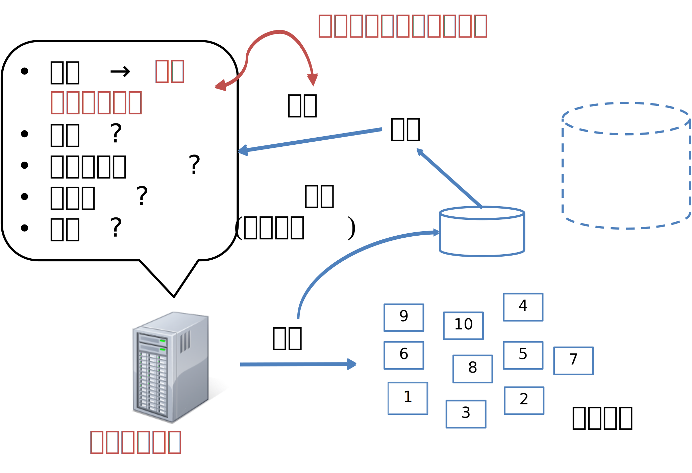{.fig-process style="inline-size: 20em;"}

### アルゴリズムを可視化する教材

例えば「ソート 可視化」で検索すると、ソート・プロセスの進展に従ってソート対象が変化する様子を表示して、アルゴリズムの理解を助けるサイトが多数見つかる。

### 可視化教材の機能

外から見えるように(可視化)して、処理(アルゴリズム)の理解を助ける

<figure class="--logic-grid-3-col --logic-right">
  

    <ul>
      <li>ソートって何をするの？入力と出力の関係</li>
      <li>正解してるの？</li>
      <li><em>どのように</em>解いているのか?</li>
    </ul>
  

  
可視化 
  

  

    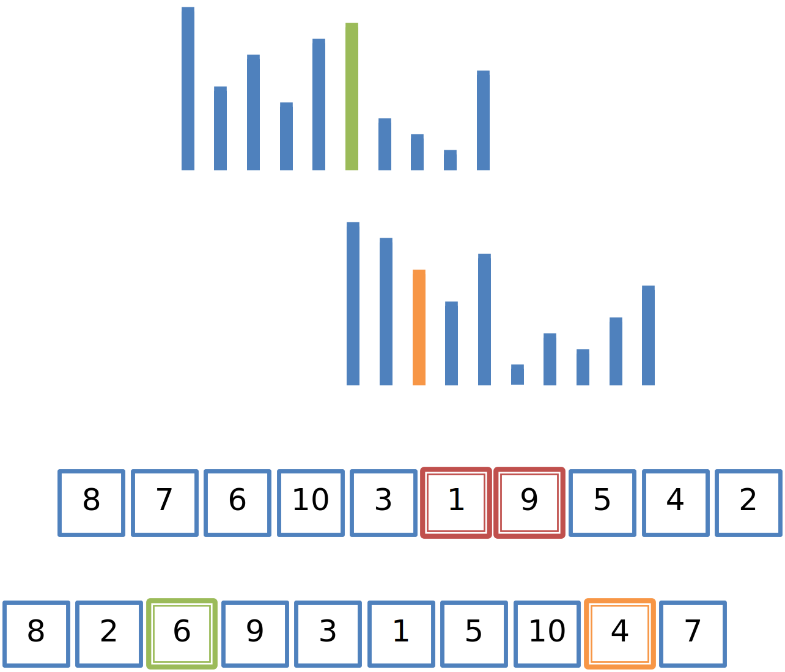
  

</figure>

### 今回のテーマ

逆をやる: 外から見えるモノからプロセスを推定

<figure class="--logic-grid-3-col --logic-left">
  

    <ul>
      <li>何をしているか？入力と出力の関係</li>
      <li>正解してるのか？</li>
      <li>どのように解いているのか？</li>
    </ul>
  

  
推定 
  

  

    
</figure>

## 方法

問題としてはソートを取り上げて、いくつかの分析手法を試みる。

- 題材: 数のソート

- 分析手法:
  * 何をしてるか？入力と出力の関係を調べる
  * 正解してるのか？正答率を評価する
  * 途中の解と~~正解~~ **最終的な解答**との距離の変化の分析する[^1]
  * 操作の時間的な共起(temporal co-occurrence)を分析する[^2]
  * 解の状態遷移における閉路(cycle)を分析する[^cycle] (今回はスキップ)

- 検証: あるアルゴリズムで実現されている振る舞いを、別のアルゴリズムで説明できるか？

[^1]: 山口 琢, 大場 みち子, コンピュータの整列処理で正解との距離は単調に減少するか?, 情報処理学会 研究報告コンピュータと教育(CE),2020-CE-157(6),1-8 (2020-10-31) , 2188-8930 <a class="url" href="http://id.nii.ac.jp/1001/00207490/">http://id.nii.ac.jp/1001/00207490/</a>

[^2]: 山口琢, 大場みち子, コンピューターの整列処理におけるデータ操作の時間的共起分析, 情報処理学会 研究報告コンピュータと教育(CE), Vol. 2020-CE-156, No. 1 pp.1—7, 2020-08-22 <a class="url" href="http://id.nii.ac.jp/1001/00206288/">http://id.nii.ac.jp/1001/00206288/</a>

[^cycle]: Yamaguchi, T., Matsuzawa, Y., Niimi, A., Oba, M. (2023). Cycles in State Transition as Trial-and-Errors in Solving Programming Exercises. In: Keane, T., Lewin, C., Brinda, T., Bottino, R. (eds) Towards a Collaborative Society Through Creative Learning. WCCE 2022. IFIP Advances in Information and Communication Technology, vol 685. Springer, Cham. <a class="url" href="https://doi.org/10.1007/978-3-031-43393-1_49">https://doi.org/10.1007/978-3-031-43393-1_49</a>

### 方法 > 題材: ソート

入力する問題

- 1から10の10個の数
- ${}_{10} \mathrm{ P }_{10} = 3,628,800$ 種類の並びを入力とする

### 方法 > 題材: ソートのアルゴリズム

次のアルゴリズムを採用する。よく学習題材になるし、プログラミング言語によるコードが容易に見つかるので。

- バブルソート
- クイックソート
- ヒープソート
- マージソート
- 選択ソート
- 挿入ソート

### 方法 > 題材: 測定のタイミング

状態遷移の**状態**はどこか？

| アルゴリズム |状態 |
| ---- | ---- |
| バブルソート |交換直後の並び |
| クイックソート |交換直後の並び |
| ヒープソート |交換直後の並び |
| 選択ソート |交換直後の並び |
| マージソート |マージ直後の並び |
| 挿入ソート |挿入直後の並び |

## 手法: 何をしているか？

どのアルゴリズムに、どの問題を与えても、
(1,2,3,4,5,6,7,8,9,10)
を出力する。

#### 分析結果

与えられた10個の数を昇順にソートしてる

#### 検証

実際はヒープソートしていても、この結果をバブルソートで説明できる。

## 手法: 正解なのか？

「与えられた10個の数を昇順にソートしてる」とするならば、いつも正解してる。

#### 分析結果

いつも正解してる、みんなが正答率100%、優秀である。

#### 検証

実際はヒープソートしていても、この結果をバブルソートで説明できる。

## 手法: 最終的な解答との距離の変化の分析

解答との距離の変化の分析は、
- 問題解決の過程で**変化する解**を記録し、
- ~~正解~~ **最終的な解答**との間に**何らかの距離**を適用して、
- 解くプロセスの時間経過に伴う距離の変化を分析し、
- 解答者の解き方などを推定する

例えば、
> **推定**:  
途中で最終解答との**距離が大きくなる**ときには、  
**解答者が迷っている**と推定する

### 最終解答との距離の変化の分析

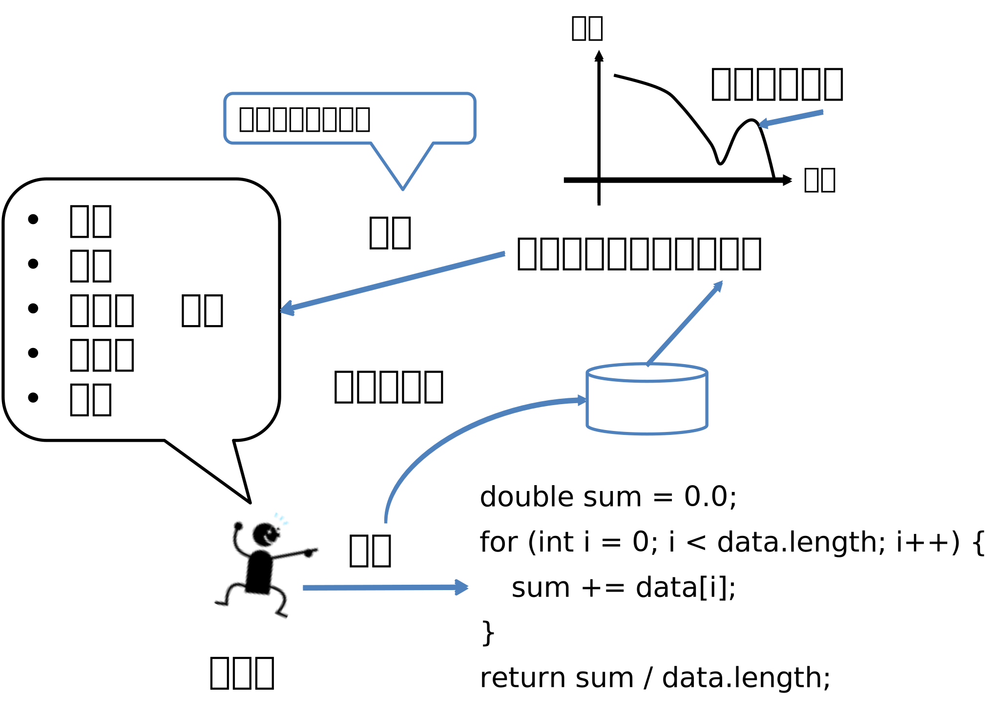{.fig-process}

### 距離 1/2

次の距離を採用する。レーベンシュタイン距離（編集距離）は研究でよく使われる。

- ハミング距離(Hamming distance)
- レーベンシュタイン距離(Levenshtein distance)
- ケイリー距離(Cayley distance)
- ウラム距離(Ulam distance)

### 距離 2/2

各距離の説明:

- ハミング距離(Hamming distance)  
2つの並びの同じ位置にあって異なる要素の個数である。  
`(2,5,3,1,4)`と`(1,2,3,4,5)`の距離は、3だけが同じで他は異なるので、4である。
- レーベンシュタイン距離(Levenshtein distance)  
1要素の挿入・削除・置換(その要素を任意の別の要素に置き換える)操作を何回繰り返すと、一方の並びから他方の並びへ変わるかの操作回数である。断りなく編集距離というとレーベンシュタイン距離を指すことが多い。
- ケイリー距離(Cayley distance)  
「交換」操作によってのみ並びを変換して、一方の並びから他方の並びにいたるまでの変換の最小回数を距離とする。
- ウラム距離(Ulam distance)  
スマホのUIなどのドラッグ&ドロップに該当する操作をして、目的の並びになるまでの最小の操作数

### 結果: 状態遷移

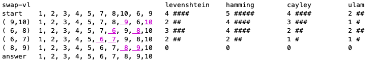

- `4 ##…`の4が最終解答との距離、`##…`の長さが目安
- 下線で赤字が操作された数
- 4つの距離について表示

### 結果: クイックソート

- 途中で遠ざかる場合がある

### 結果: ヒープソート

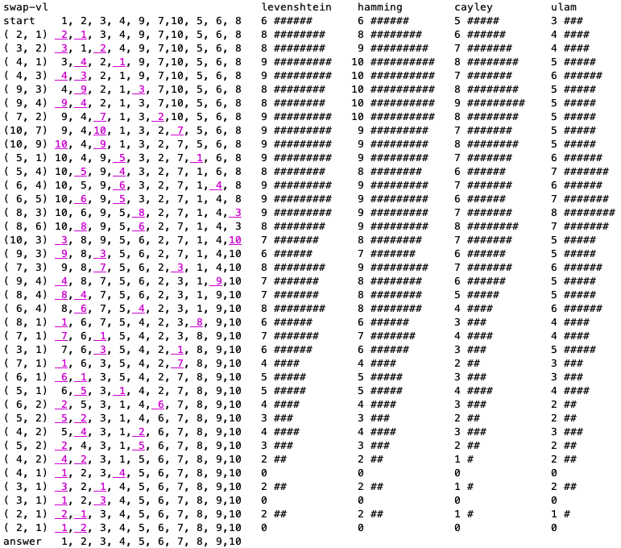{style="inline-size: 25em;"}

- 途中で遠ざかる場合がある
- 距離=0、すなわち最終解答に達した後でも、遠ざかる場合がある

### 結果

<table class="result">
<thead>
<tr><td></td><th colspan="2">Levenshtein距離</th><th colspan="2">Hamming距離</th><th colspan="2">Caley距離</th><th colspan="2">Ulam距離</th></tr>
<tr><td></td><th>増加した問題数</th><th>割合</th><th>増加した問題数</th><th>割合</th><th>増加した問題数</th><th>割合</th><th>増加した問題数</th><th>割合</th></tr>
</thead>
<tbody>
<tr><th>バブルソート</th><td>2,743,264</td><td>75.6%</td><td>3,512,825</td><td>96.8%</td><td>3,624,619</td><td>99.9%</td><td>0</td><td>0.0%</td></tr>
<tr><th>ヒープソート</th><td>3,628,800</td><td>100.0%</td><td>3,628,800</td><td>100.0%</td><td>3,628,800</td><td>100.0%</td><td>3,628,800</td><td>100.0%</td></tr>
<tr><th>挿入ソート</th><td>1,339,176</td><td>36.9%</td><td>1,964,215</td><td>54.1%</td><td>3,443,878</td><td>94.9%</td><td>0</td><td>0.0%</td></tr>
<tr><th>マージソート</th><td>1,852,755</td><td>51.1%</td><td>2,432,789</td><td>67.0%</td><td>3,426,453</td><td>94.4%</td><td>0</td><td>0.0%</td></tr>
<tr><th>クイックソート</th><td>1,034,478</td><td>28.5%</td><td>0</td><td>0.0%</td><td>1,089,872</td><td>30.0%</td><td>872,908</td><td>24.1%</td></tr>
<tr><th>選択ソート</th><td>0</td><td>0.0%</td><td>0</td><td>0.0%</td><td>0</td><td>0.0%</td><td>0</td><td>0.0%</td></tr>
</tbody>
</table>

解くプロセスの間に、最終解答との距離が増加した問題の数と、全問題数3.6M個に対する割合。

### 検証

<table class="result">
<thead>
<tr><td></td><th colspan="2">Levenshtein距離</th><th colspan="2">Hamming距離</th><th colspan="2">Caley距離</th><th colspan="2">Ulam距離</th></tr>
<tr><td></td><th>増加した問題数</th><th>割合</th><th>増加した問題数</th><th>割合</th><th>増加した問題数</th><th>割合</th><th>増加した問題数</th><th>割合</th></tr>
</thead>
<tbody>
<tr><th class="em">バブルソート</th><td>2,743,264</td><td class="em">75.6%</td><td>3,512,825</td><td>96.8%</td><td>3,624,619</td><td>99.9%</td><td>0</td><td class="em">0.0%</td></tr>
<tr><th class="em">ヒープソート</th><td>3,628,800</td><td class="em">100.0%</td><td>3,628,800</td><td>100.0%</td><td>3,628,800</td><td>100.0%</td><td>3,628,800</td><td class="em">100.0%</td></tr>
<tr><th>挿入ソート</th><td>1,339,176</td><td>36.9%</td><td>1,964,215</td><td>54.1%</td><td>3,443,878</td><td>94.9%</td><td>0</td><td>0.0%</td></tr>
<tr><th>マージソート</th><td>1,852,755</td><td>51.1%</td><td>2,432,789</td><td>67.0%</td><td>3,426,453</td><td>94.4%</td><td>0</td><td>0.0%</td></tr>
<tr><th>クイックソート</th><td>1,034,478</td><td>28.5%</td><td>0</td><td>0.0%</td><td>1,089,872</td><td>30.0%</td><td>872,908</td><td>24.1%</td></tr>
<tr><th>選択ソート</th><td>0</td><td>0.0%</td><td>0</td><td>0.0%</td><td>0</td><td>0.0%</td><td>0</td><td>0.0%</td></tr>
</tbody>
</table>

実際はヒープソートしている場合に、その結果(途中で最終解答から遠ざかる現象の発生頻度)をバブルソートで説明する…のは厳しいのではないか？

### 解答との距離の変化 > 考察

- ソートのプロセスでは必ずしも距離が減少(単調非増加)しない:
  * 距離が広がることがあるし、
  * 正解に達したにもかかわらず再び誤った順序に変わることすらある
- ソートアルゴリズムに**迷い**があるとは思えない
- そこで、これが反例となって、解答との距離が遠ざかるからといって「迷ってる」とは、一般的には言えない

しかし、
- 途中で遠ざからない「アルゴリズム x 距離」の組み合わせもある
- プロセスについて、距離から何らかの情報を引き出せるのではないか？

## 手法: 操作の時間的な共起

操作の時間的な共起分析は、
- 問題解決の過程で行われる操作について、
- いくつかの操作が**時間的に近くで行われる頻度**を集計する[^colloc]。

このように集計する動機は、テキスト分析における語の共起と同様

ある複数の操作が頻繁に時間的に近くで行われるとき、それらの操作は
- 何らかの定型操作であったり、
- 考え方の類似性の手がかりになったりする

と解釈できる。

[^colloc]: 山口 琢, 大場 みち子, 編集操作の時間的共起分析の提案, 情報処理学会 研究報告コンピュータと教育（CE）,2019-CE-151(9),1-7 (2019-09-28), 2188-8930 <a class="url" href="http://id.nii.ac.jp/1001/00199567/">http://id.nii.ac.jp/1001/00199567/</a>

### 時間的共起の例: 文章の並べ替え作文

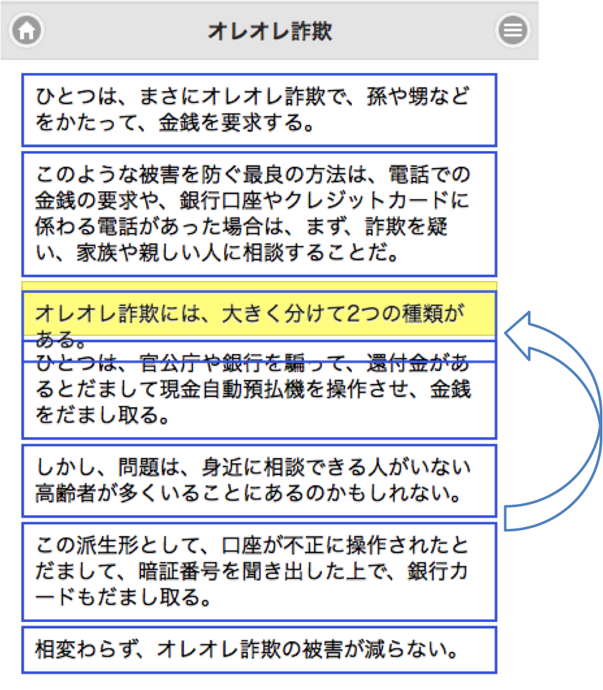{style="block-size: 15lh;"}

「ドラッグ&ドロップで並べ替えて、「オレオレ詐欺」の説明として、あなたが適切と思う文章を完成させなさい。」

文章では順番が重要ということを学ぶ教材[^jigsaw-text][^hayashi][^nishimura][^utada]

[^jigsaw-text]: 山口 琢, 大場 みち子, 高橋 慈子, 小林 龍生, ジグソー・テキストによる文並べ替え操作の測定, 情報処理学会 研究報告コンピュータと教育(CE), 2017-CE-142(27),1-6, 2017 <a class="url" href="http://id.nii.ac.jp/1001/00184931/">http://id.nii.ac.jp/1001/00184931/</a>

[^hayashi]: 林 浩一, 山口 琢, 大場 みち子, ロジカルシンキングにおける基本的関係についてのジグソー・テキストを用いた理解度評価, 情報処理学会 研究報告コンピュータと教育(CE), 2019-CE-151(13),1-8 (2019-09-28) , 2188-8930 <a class="url" href="http://id.nii.ac.jp/1001/00199571/">http://id.nii.ac.jp/1001/00199571/</a>

[^nishimura]: 西村 萌, 米澤 彩乃, 松澤 芳昭, パズル型プログラミング問題を利用した初学者の迷いや思考プロセスの個別分析の試み, 情報処理学会 研究報告コンピュータと教育(CE), 2023-CE-169(10),1-8 (2023-03-04) , 2188-8930 <a class="url" href="http://id.nii.ac.jp/1001/00225009/">http://id.nii.ac.jp/1001/00225009/</a>

[^utada]: 歌田 夢香, 加藤 輝実, 山口 琢, 大場 みち子, 新美 礼彦, アジャイル開発におけるプロダクトオーナー育成支援 ワークショップの実践, 実践的IT教育シンポジウム rePiT 論文集, 2024, 2024 巻, 第10回 実践的IT教育シンポジウム rePiT2024 in 京都, p. 35-42, 公開日 2024/03/07 <a class="url" href="https://doi.org/10.11309/repit.2024.0_35">https://doi.org/10.11309/repit.2024.0_35</a>

### 時間的共起の例: 文章の並べ替え

問題と時間的な共起行列

<ul class="puzzle">
<li>s2相変わらず、オレオレ詐欺の被害が減らない。</li>
<li>s3オレオレ詐欺には、大きく分けて<em>2つの</em>種類がある。</li>
<li>s4<em>ひとつは</em>、まさにオレオレ詐欺で、孫や甥などをかたって、金銭を要求する。</li>
<li>s5<em>ひとつは</em>、官公庁や銀行を騙って、還付金があるとだまして現金自動預払機を操作させ、金銭をだまし取る。</li>
<li>s6この派生形として、口座が不正に操作されたとだまして、暗証番号を聞き出した上で、銀行カードもだまし取る。</li>
<li>s7このような被害を防ぐ最良の方法は、電話での金銭の要求や、銀行口座やクレジットカードに係わる電話があった場合は、まず、詐欺を疑い、家族や親しい人に相談することだ。</li>
<li>s8しかし、問題は、身近に相談できる人がいない高齢者が多くいることにあるのかもしれない。</li>
</ul>

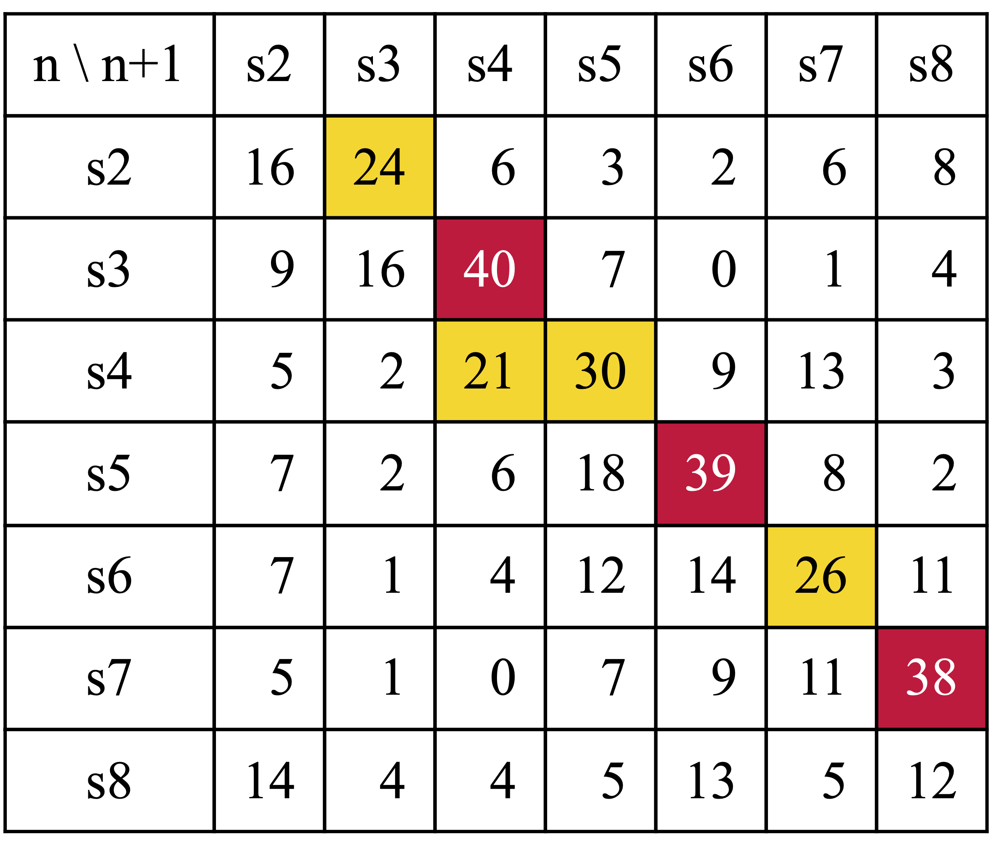{style="block-size: 8lh;"}

#### 推定の例
`s3`の次に`s4`を動かす回数が40回と多いのは、`s3`の「…2つの」と`s4`の「ひとつは…」を対応付けて考えるからではないか？

### 結果: ソート

ソートに時間的共起分析を適用

### アルゴリズムB

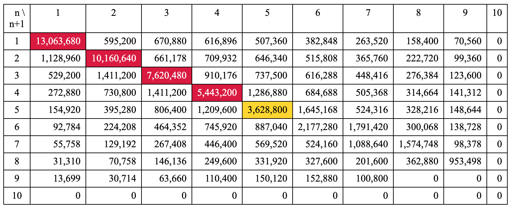{style="block-size: 12lh;"}

- 同じ数を続けて動かすことが多い
- 10は動かさない

### アルゴリズムQ

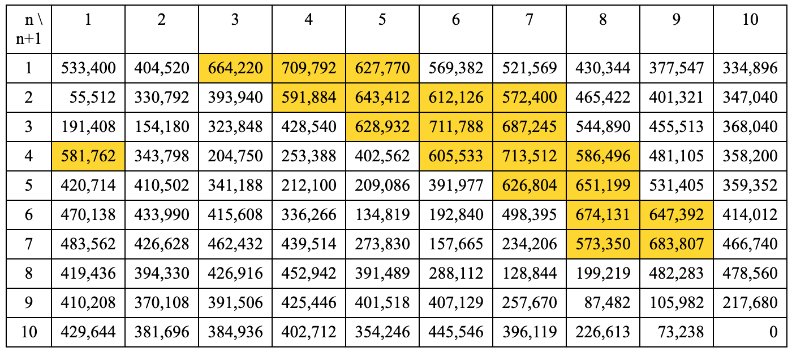{style="block-size: 12lh;"}

- 「4の次に1」が多い

### アルゴリズムH

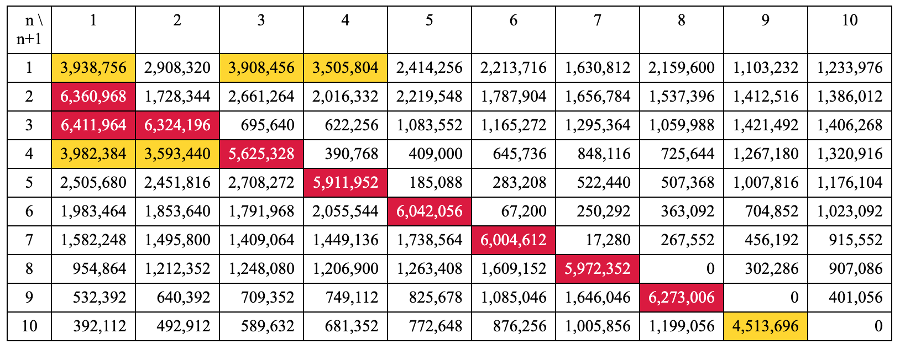{style="block-size: 12lh;"}

- 次に1つ小さな数を動かすことが多い

### アルゴリズムM

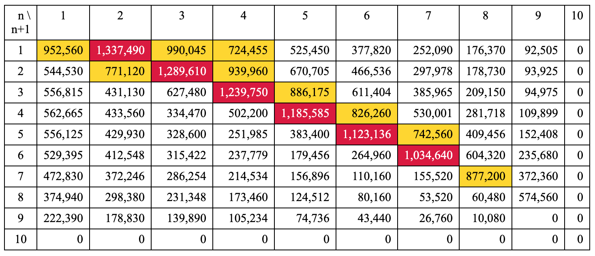{style="block-size: 12lh;"}

- 次に1つ大きな数を動かすことが多い

### アルゴリズムS

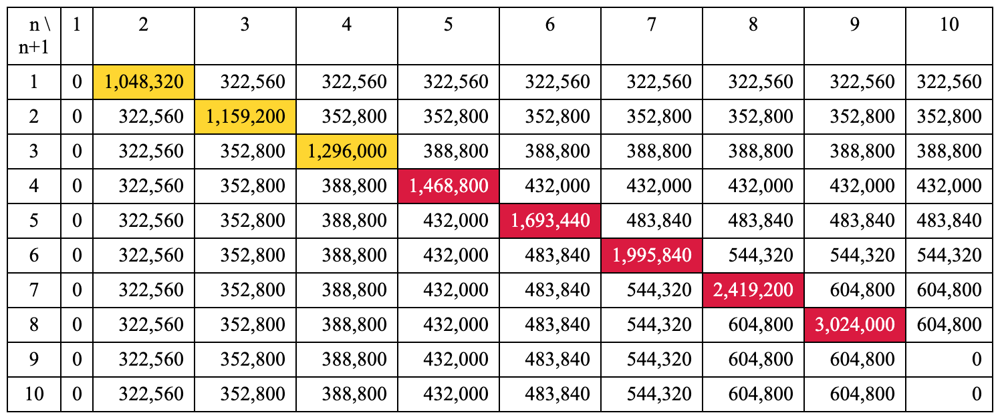{style="block-size: 12lh;"}

- 次に1つ大きな数を動かすことが多い
- 次に1が動かされることが**ない**

### アルゴリズムI

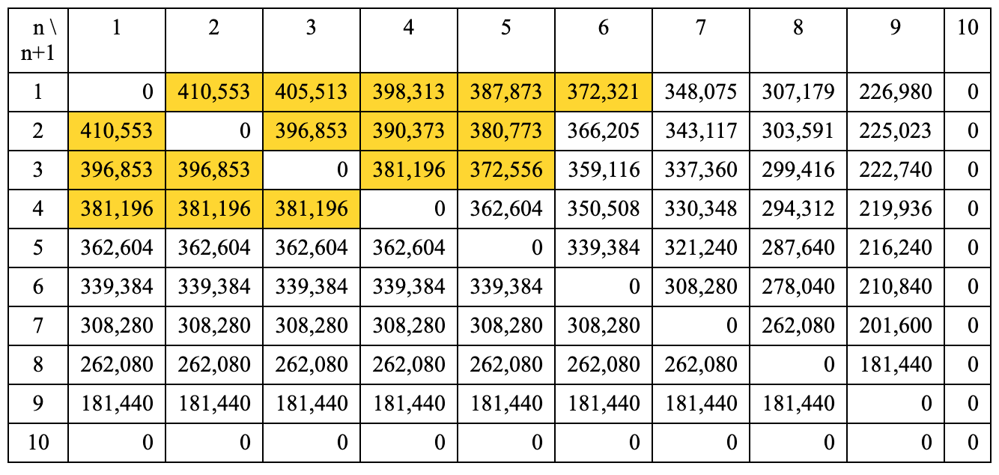{style="block-size: 12lh;"}

- 同じ数を続けて動かさない
- 10を動かさない

### 答え合わせ: アルゴリズムB

{style="block-size: 12lh;"}

バブルソート
- 同じ数を続けて動かすことが多い
- 10は動かさない

### 答え合わせ: アルゴリズムQ

{style="block-size: 12lh;"}

クイックソート
- 「4の次に1」が多い

### 答え合わせ: アルゴリズムH

{style="block-size: 12lh;"}

ヒープソート
- 次に1つ小さな数を動かすことが多い

### 答え合わせ: アルゴリズムM

{style="block-size: 12lh;"}

マージソート
- 次に1つ大きな数を動かすことが多い

### 答え合わせ: アルゴリズムS

{style="max-block-size: 35dvh;"}

選択ソート
- 次に1つ大きな数を動かすことが多い
- 次に1が動かされることが**ない**

### 答え合わせ: アルゴリズムI

{style="max-block-size: 35dvh;"}

挿入ソート
- 同じ数を続けて動かさない
- 10を動かさない

### 検証

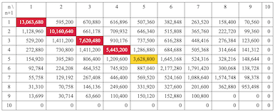{.em}

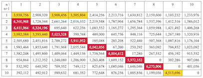{.em}

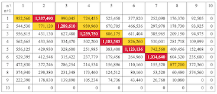

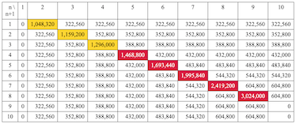

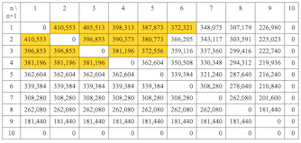

実際はヒープソートしている場合に、その結果(時間的な共起行列)をバブルソートで説明できるか …微妙

### 操作の時間的な共起 > 考察

時間的な共起分析は:
- ソート・アルゴリズムの特徴を表している:
- アルゴリズムそのものまでは遠い…

コンピューターによる整列はどれも正解するが、内部的なアルゴリズムが異なると、外から観察できる並べ替え操作が異なって表現できた。

## 全体の考察: 正解の存在

分析手法にとっての**正解**の存在
- 唯一の正解が必要
- 正解が複数存在してもよい
- 正解が誰にも分からなくてもよい
- 正解が存在しなくてもよい
- 正解は20年後に分かるが今判断する必要があり、その判断を今評価したい

正解を前提としない分析
- 途中の解と最終的な解答との距離の変化の分析  
- 操作の時間的な共起
- 状態遷移の閉路(今回はスキップ)

## 全体の考察: このような研究の意義

- 学校教育
  * 「答えのない課題解決に挑む」人材の育成[^3]
  * 試行錯誤の検出、内容の評価[^4]

- オフィス・アプリケーション
  * 情報の一貫性(coherence)、整合性(consistency)をもたらそうとする**操作**に基づく品質評価。望ましい行動。  
  vs. アウトプットの品質

[^3]: 中央教育審議会：幼稚園、小学校、中学校、高等学校及び特別支援学校の学習指導要領等の改善及び必要な方策等について(答申)(中教審第197号)、p.10、文部科学省（オンライン）<a class="url" href="https://www.mext.go.jp/b_menu/shingi/chukyo/chukyo0/toushin/1380731.htm">https://www.mext.go.jp/b_menu/shingi/chukyo/chukyo0/toushin/1380731.htm</a>

[^4]: 国立教育政策研究所 教育課程研究センター：「指導と評価の一体化」のための学習評価に関する参考資料(高等学校編) 情報、pp.54-59、（オンライン）、入手先<a class="url" href="https://www.nier.go.jp/kaihatsu/shidousiryou.html">https://www.nier.go.jp/kaihatsu/shidousiryou.html</a>

## 不良設定問題

- プロセスの分析が**正解の存在を前提としない**ことを示した
- 「解き方の選択」も出力と考えれば、入力に対する出力を分析するというスキームは、いぜんとして維持される。
- そのうえで、「解き方の選択に正解はない」はありえるだろう。

## 今後の面白そうなテーマ

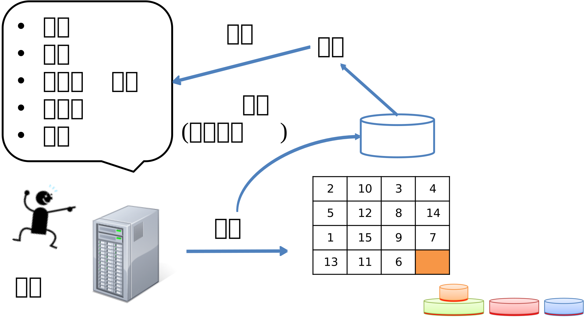{.fig-process .right style="inline-size: 17rem;"}

- 他の問題: 人にも解けて、(既知のアルゴリズムで)コンピューターにも解ける
  * 15パズル、解けない問題もある
  * ハノイの塔
  * 上達すると、**その人にとっての距離**が変わる…  
その人にとっての距離の変化 ∈ **理解**  
…かも
- 言語モデルに「オレオレ詐欺」を解かせる

<!--
Web Publication (WebPub) Format
$ vivliostyle build slide.md -o web/ -f webpub
-->