# 人の問題解決プロセスの分析手法をコンピューターに適用する試み #

### 著者{.author}

山口 琢(フリーランス)

大場 みち子(京都橘大学)

### 版{.version}

v1

#### 日付{.date}

2025-03-17

## はじめに

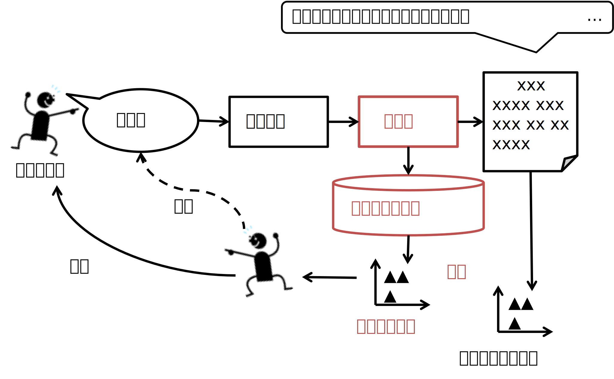{.fig-process style="inline-size: 15rem;"}

人の問題解決プロセス(特に読み書き)を測定・分析する研究
- プロセスをデータ化/測定する手法: デジタル教材など
- 測定データを分析・評価する手法

研究会の趣旨に合ってるかどうか…

## プロセスの研究の進み方

プログラミングのプロセスを評価したい。

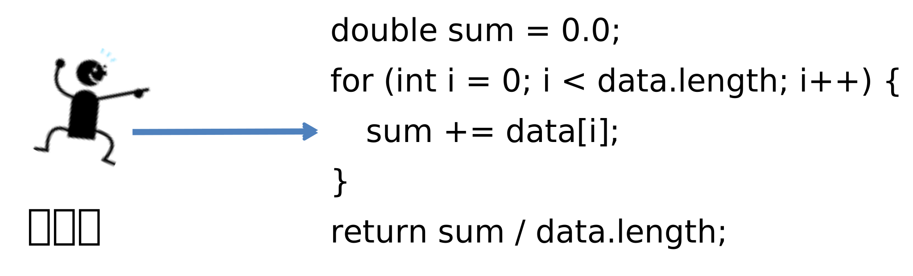{.fig-process}

### プロセスの研究

プログラミングのアプリを工夫してプロセスをデータ化

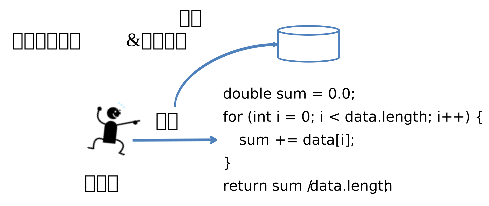{.fig-process}

### プロセスの研究

測定データを分析して推定する。

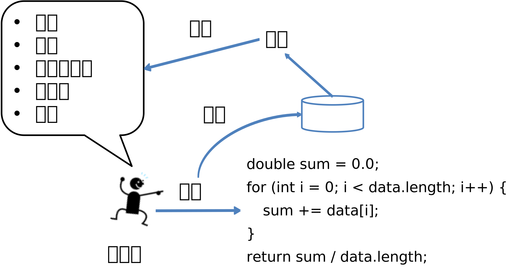{.fig-process}

### プロセスの研究

測定、分析、推定を評価

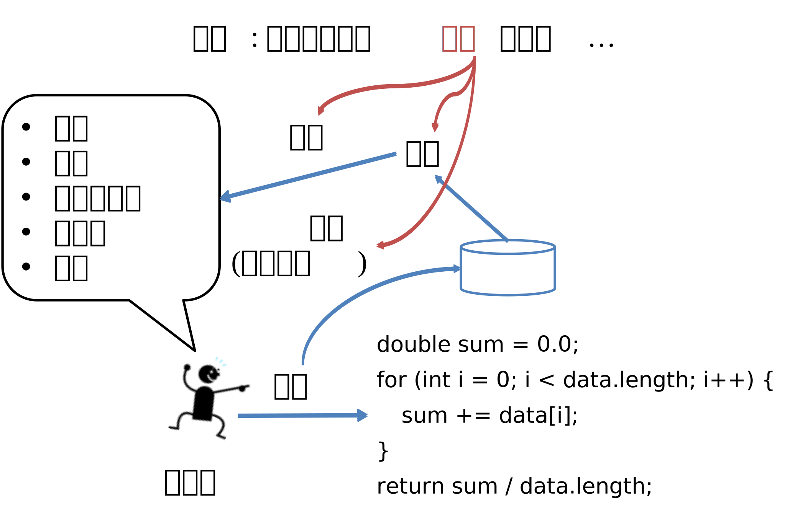{.fig-process}

### プロセスの研究

頭の中と答え合わせしたいが、できないので…

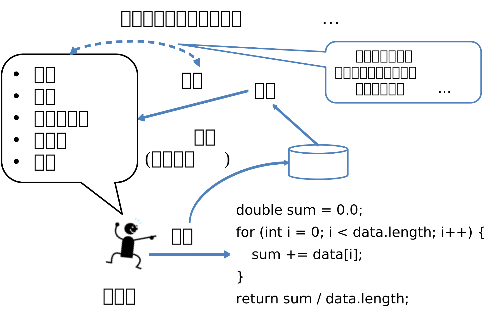{.fig-process}

### プロセスの研究

他のデータと答え合わせする。

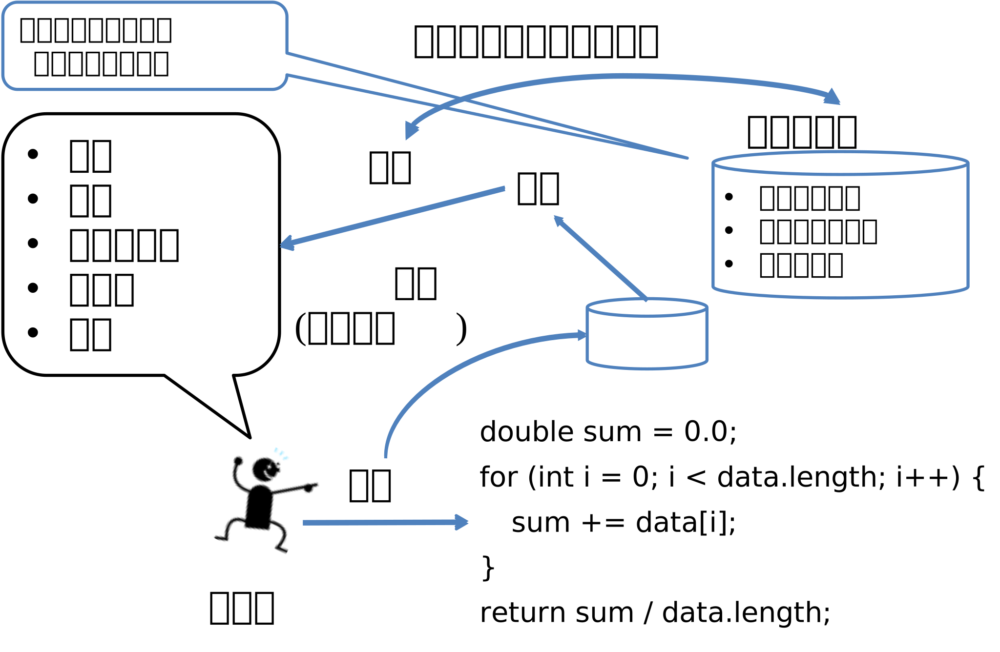{.fig-process}

## 今日のお題

アルゴリズムが分かっているコンピューターによる問題解決プロセスならば、直接答え合わせできるだろう。

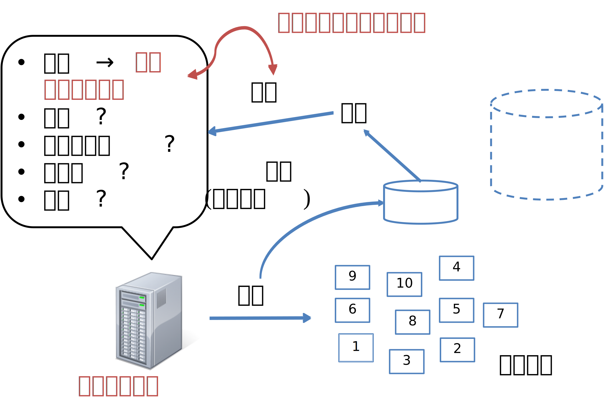{.fig-process style="inline-size: 20em;"}

### アルゴリズムを可視化する教材

ソートの場合
- [バブルソート](https://algoful.com/Archive/Algorithm/BubbleSort)
- [クイックソート](https://algoful.com/Archive/Algorithm/QuickSort)

### 可視化教材の機能

外から見えるように(可視化)して、処理(アルゴリズム)の理解を助ける

<figure class="grid-3-col">
  

    <ul>
      <li>ソートって何をするの？入力と出力の関係</li>
      <li>正解してるの？</li>
      <li><em>どのように</em>解いているのか?</li>
    </ul>
  

  
可視化 
    
  

  

    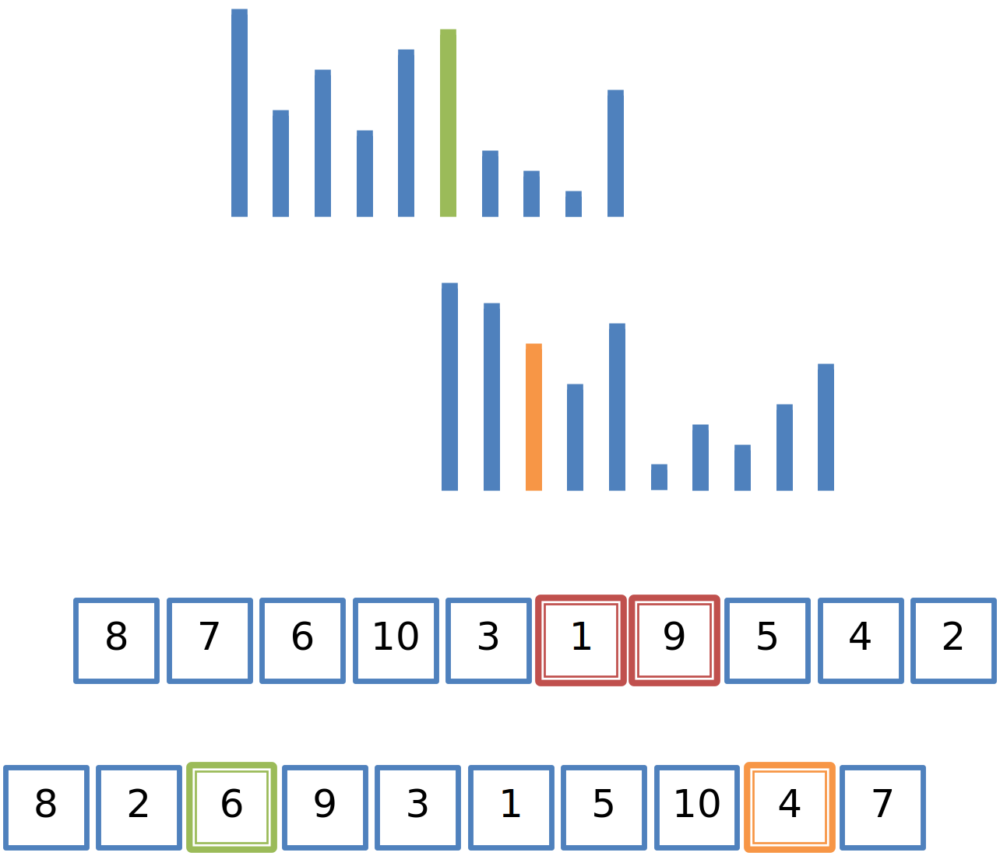
  

</figure>

### 今回のテーマ

逆をやる: 外から見えるモノからプロセスを推定

<figure class="grid-3-col">
  

    <ul>
      <li>何をしているか？入力と出力の関係</li>
      <li>正解してるのか？</li>
      <li>どのように解いているのか？</li>
    </ul>
  

  
推定 
    
  

  

    
</figure>

## 方法

問題としてはソートを取り上げて、いくつかの分析手法を試みる。

- 題材: 数のソートを

- 分析手法:
  * 何をしてるか？入力と出力の関係
  * 正解してるのか？
  * 途中の解と~~正解~~ **最終的な解答**との距離の変化の分析
  * 操作の時間的な共起分析(temporal co-occurrence)分析
  * 解の状態遷移における閉路(cycle)の分析(今回はスキップ)

### 方法 > 題材: ソート

入力する問題

- 1から10の10個の数
- ${}_{10} \mathrm{ P }_{10} = 3,628,800$ 種類の並びを入力とする

### 方法 > 題材: ソートのアルゴリズム

- バブルソート
- クイックソート
- ヒープソート
- マージソート
- 選択ソート
- 挿入ソート

### 方法 > 題材: 測定のタイミング

状態遷移の**状態**はどこか？

| アルゴリズム |状態 |
| ---- | ---- |
| バブルソート |交換直後の並び |
| クイックソート |交換直後の並び |
| ヒープソート |交換直後の並び |
| 選択ソート |交換直後の並び |
| マージソート |マージ直後の並び |
| 挿入ソート |挿入直後の並び |

## 何をしているか？

どのアルゴリズムに、どの問題を与えても、
(1,2,3,4,5,6,7,8,9,10)
を出力する。

- 推定 → 与えられた10個の数を昇順にソートしてる
- ここで、実際はヒープソートしていても、バブルソートでモデリングしてOK

## 正解なのか？

与えられた10個の数を昇順にソートしてる…とするならば

- いつも正解してる、みんなが正答率100%
- ここで、実際はヒープソートしていても、バブルソートでモデリングしてOK

## 最終的な解答との距離の変化の分析

解答との距離の変化の分析は、
- 問題解決の過程で**変化する解**を記録し、
- ~~正解~~ **最終的な解答**との間に**何らかの距離**を適用して、
- 解くプロセスの時間経過に伴う距離の変化を分析し、
- 解答者の解き方などを推定する

例えば、
> **推定**:  
途中で最終解答との**距離が大きくなる**ときには、  
**解答者が迷っている**と推定する

### 最終解答との距離の変化の分析

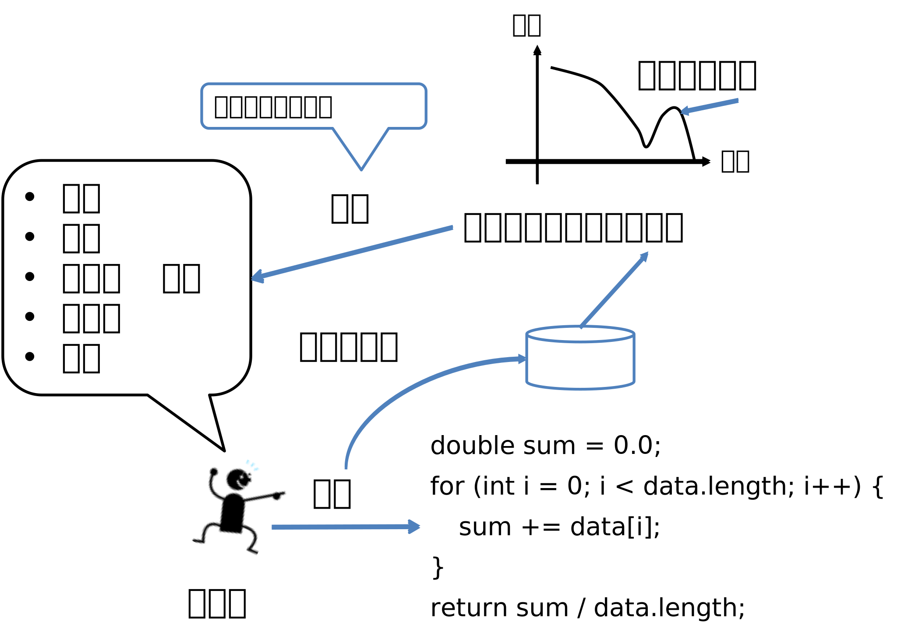{.fig-process}

### 距離 1/2

- ハミング距離(Hamming distance)
- レーベンシュタイン距離(Levenshtein distance)
- ケイリー距離(Cayley distance)
- ウラム距離(Ulam distance)

### 距離 2/2

- ハミング距離(Hamming distance)  
2つの並びの同じ位置にあって異なる要素の個数である。  
`(2,5,3,1,4)`と`(1,2,3,4,5)`の距離は、3だけが同じで他は異なるので、4である。
- レーベンシュタイン距離(Levenshtein distance)  
1要素の挿入・削除・置換(その要素を任意の別の要素に置き換える)操作を何回繰り返すと、一方の並びから他方の並びへ変わるかの操作回数である。断りなく編集距離というとレーベンシュタイン距離を指すことが多い。
- ケイリー距離(Cayley distance)  
「交換」操作によってのみ並びを変換して、一方の並びから他方の並びにいたるまでの変換の最小回数を距離とする。
- ウラム距離(Ulam distance)  
スマホのUIなどのドラッグ&ドロップに該当する操作をして、目的の並びになるまでの最小の操作数

### 結果: 状態遷移

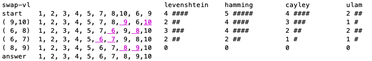

- `4 ##…`の4が最終解答との距離、`##…`の長さが目安
- 下線で赤字が操作された数
- 4つの距離について表示

### 結果: クイックソート

- 途中で遠ざかる場合がある

### 結果: ヒープソート

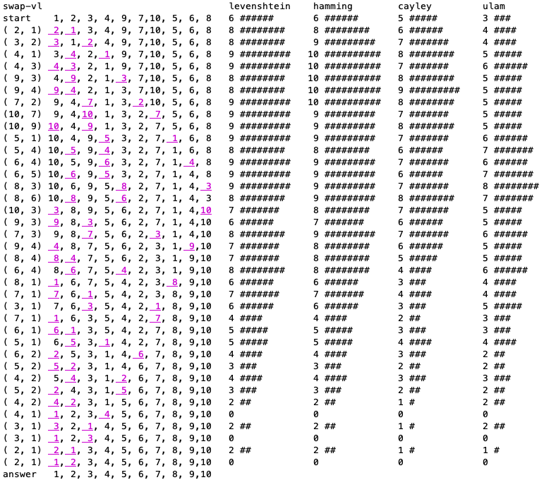{style="block-size: 50dvh;"}

### 結果: ヒープソート

{style="block-size: 13rem;"}

- 途中で遠ざかる場合がある
- 距離=0、すなわち最終解答に達した後でも、遠ざかる場合がある

### 結果

<table id="result">
<thead>
<tr><td></td><th colspan="2">Levenshtein距離</th><th colspan="2">Hamming距離</th><th colspan="2">Caley距離</th><th colspan="2">Ulam距離</th></tr>
<tr><td></td><th>増加した問題数</th><th>割合</th><th>増加した問題数</th><th>割合</th><th>増加した問題数</th><th>割合</th><th>増加した問題数</th><th>割合</th></tr>
</thead>
<tbody>
<tr><th>バブルソート</th><td>2,743,264</td><td>75.6%</td><td>3,512,825</td><td>96.8%</td><td>3,624,619</td><td>99.9%</td><td>0</td><td>0.0%</td></tr>
<tr><th>ヒープソート</th><td>3,628,800</td><td>100.0%</td><td>3,628,800</td><td>100.0%</td><td>3,628,800</td><td>100.0%</td><td>3,628,800</td><td>100.0%</td></tr>
<tr><th>挿入ソート</th><td>1,339,176</td><td>36.9%</td><td>1,964,215</td><td>54.1%</td><td>3,443,878</td><td>94.9%</td><td>0</td><td>0.0%</td></tr>
<tr><th>マージソート</th><td>1,852,755</td><td>51.1%</td><td>2,432,789</td><td>67.0%</td><td>3,426,453</td><td>94.4%</td><td>0</td><td>0.0%</td></tr>
<tr><th>クイックソート</th><td>1,034,478</td><td>28.5%</td><td>0</td><td>0.0%</td><td>1,089,872</td><td>30.0%</td><td>872,908</td><td>24.1%</td></tr>
<tr><th>選択ソート</th><td>0</td><td>0.0%</td><td>0</td><td>0.0%</td><td>0</td><td>0.0%</td><td>0</td><td>0.0%</td></tr>
</tbody>
</table>

解くプロセスの間に、最終解答との距離が増加した問題の数と割合。

### 解答との距離の変化 > 考察

- ソートのプロセスでは必ずしも距離が減少(単調非増加)しない:
  * 距離が広がることがあるし、
  * 正解に達したにもかかわらず再び誤った順序に変わることすらある
- ソートアルゴリズムに**迷い**があるとは思えない
- 解答との距離が遠ざかるからといって「迷ってる」とは、一般的には言えない

しかし、
- 遠ざからない アルゴリズム x 距離 の組み合わせもある
- 距離から何らかの情報を引き出せるのではないか？

## 操作の時間的な共起

操作の時間的な共起分析は、
- 問題解決の過程で行われる操作について、
- いくつかの操作が**時間的に近くで行われる頻度**を集計する。

このように集計する動機は、テキスト分析における語の共起と同様

ある複数の操作が頻繁に時間的に近くで行われるとき、それらの操作は
- 何らかの定型操作であったり、
- 考え方の類似性の手がかりになると解釈できる。

### 時間的共起の例: 文章の並べ替え作文

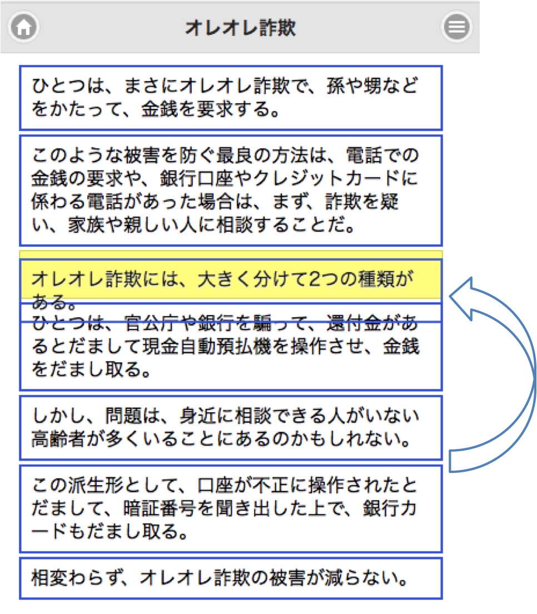{style="block-size: 50dvh;"}

{style="block-size: 50dvh;"}

### 時間的共起の例: 文章の並べ替え

問題と時間的な共起行列

<ul class="puzzle">
<li>s2相変わらず、オレオレ詐欺の被害が減らない。</li>
<li>s3オレオレ詐欺には、大きく分けて<em>2つの</em>種類がある。</li>
<li>s4<em>ひとつは</em>、まさにオレオレ詐欺で、孫や甥などをかたって、金銭を要求する。</li>
<li>s5ひとつは、官公庁や銀行を騙って、還付金があるとだまして現金自動預払機を操作させ、金銭をだまし取る。</li>
<li>s6この派生形として、口座が不正に操作されたとだまして、暗証番号を聞き出した上で、銀行カードもだまし取る。</li>
<li>s7このような被害を防ぐ最良の方法は、電話での金銭の要求や、銀行口座やクレジットカードに係わる電話があった場合は、まず、詐欺を疑い、家族や親しい人に相談することだ。</li>
<li>s8しかし、問題は、身近に相談できる人がいない高齢者が多くいることにあるのかもしれない。</li>
</ul>

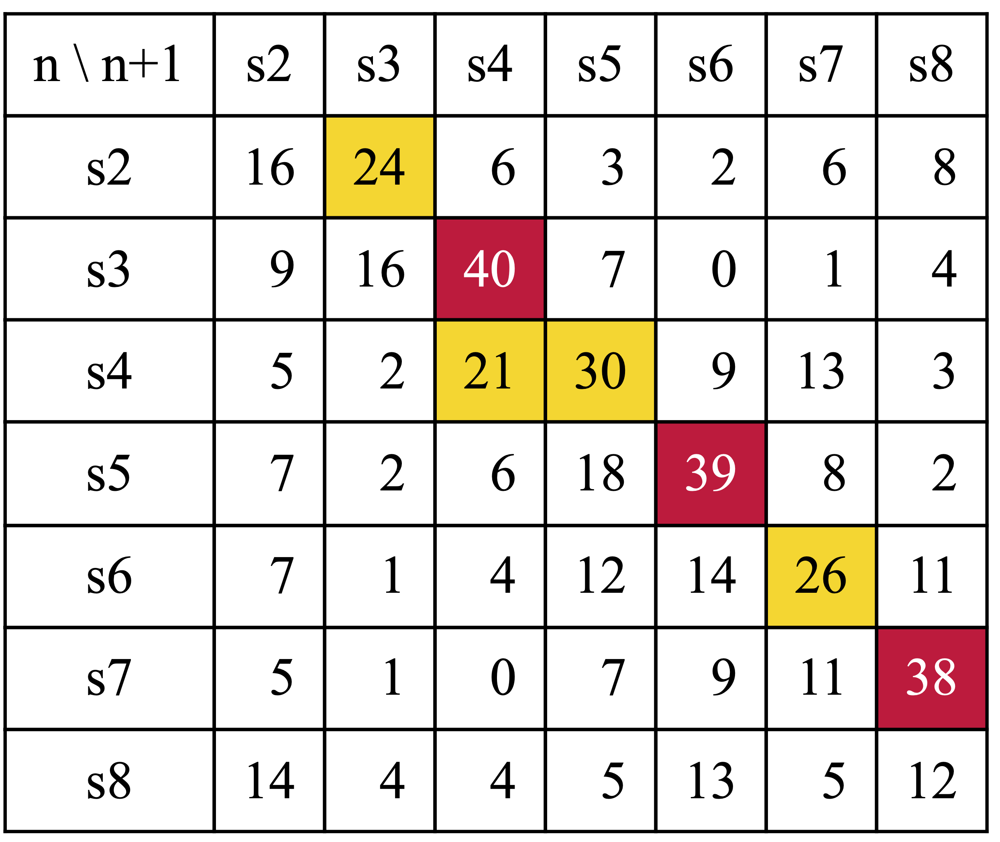

<!--

<table class="bigram">
<colgroup><col><col class="cell"><col class="cell"><col class="cell"><col class="cell"><col class="cell"><col class="cell"><col class="cell"></colgroup><thead>
<tr><td>n \ n+1</td><th scope="col">s1</th><th scope="col">s2</th><th scope="col">s3</th><th scope="col">s4</th><th scope="col">s5</th><th scope="col">s6</th><th scope="col">s7</th></tr></thead>
<tbody>
<tr><th scope="row">s1</th><td class="">18</td><td class="">17</td><td class="">7</td><td class="">6</td><td class="">3</td><td class="">9</td><td class="">7</td></tr>
<tr><th scope="row">s2</th><td class="">7</td><td class="">9</td><td class="two-sigma" aria-labelledby="cc_two-sigma">30</td><td class="">16</td><td class="">1</td><td class="">1</td><td class="">1</td></tr>
<tr><th scope="row">s3</th><td class="">6</td><td class="">4</td><td class="">16</td><td class="one-sigma" aria-labelledby="cc_one-sigma">25</td><td class="">7</td><td class="">14</td><td class="">4</td></tr>
<tr><th scope="row">s4</th><td class="">2</td><td class="">2</td><td class="">11</td><td class="">15</td><td class="two-sigma" aria-labelledby="cc_two-sigma">41</td><td class="">7</td><td class="">6</td></tr>
<tr><th scope="row">s5</th><td class="">15</td><td class="">0</td><td class="">8</td><td class="">3</td><td class="">9</td><td class="one-sigma" aria-labelledby="cc_one-sigma">19</td><td class="">8</td></tr>
<tr><th scope="row">s6</th><td class="">3</td><td class="">3</td><td class="">4</td><td class="">7</td><td class="">4</td><td class="">11</td><td class="two-sigma" aria-labelledby="cc_two-sigma">38</td></tr>
<tr><th scope="row">s7</th><td class="">14</td><td class="">2</td><td class="">2</td><td class="">11</td><td class="">7</td><td class="">8</td><td class="">5</td></tr>
</tbody>
</table>

-->

### 結果: ソート

ソートに時間的共起分析を適用

### アルゴリズムB

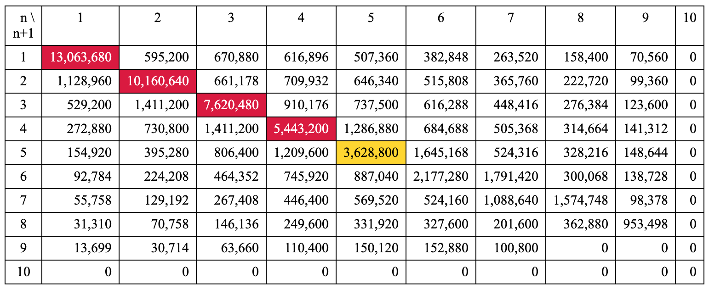{style="max-block-size: 40dvh;"}

- 同じ数を続けて動かすことが多い
- 10は動かさない

### アルゴリズムQ

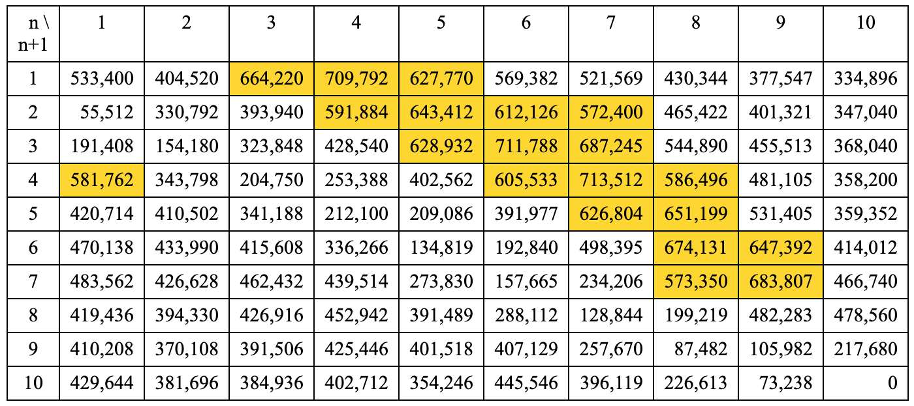{style="max-block-size: 40dvh;"}

- 「4の次に1」が多い

### アルゴリズムH

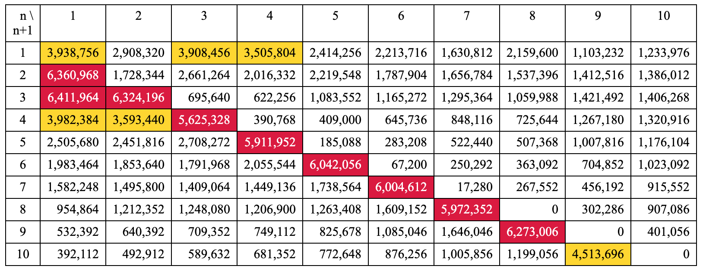{style="max-block-size: 40dvh;"}

- 次に1つ小さな数を動かすことが多い

### アルゴリズムM

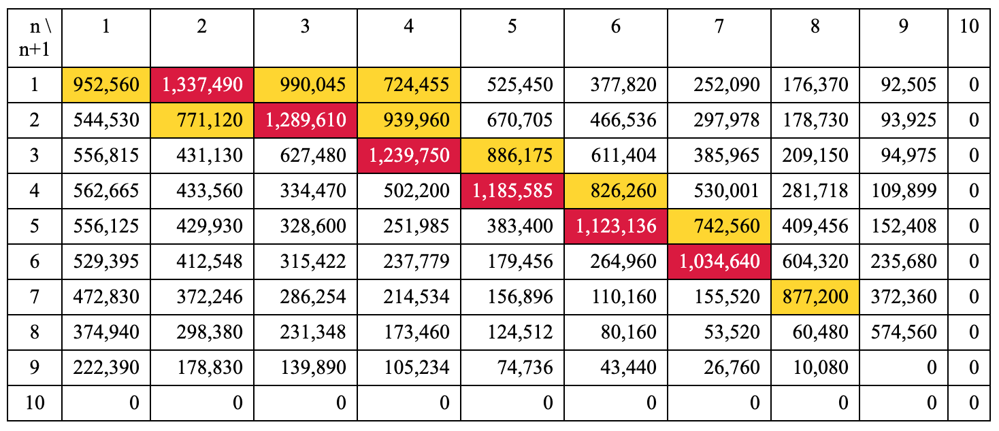{style="max-block-size: 40dvh;"}

- 次に1つ大きな数を動かすことが多い

### アルゴリズムS

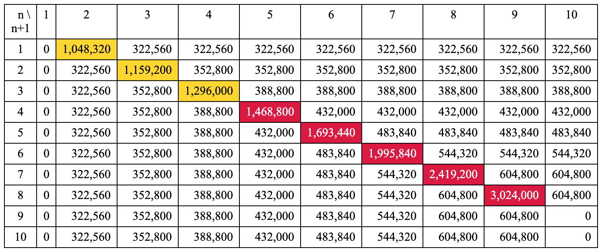{style="max-block-size: 40dvh;"}

- 次に1つ大きな数を動かすことが多い
- 次に1が動かされることが**ない**

### アルゴリズムI

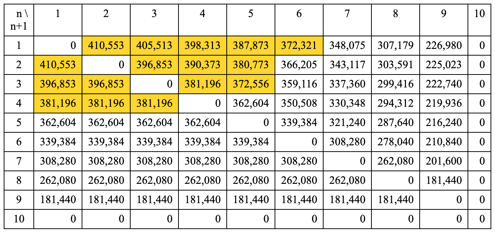{style="max-block-size: 40dvh;"}

- 同じ数を続けて動かさない
- 10を動かさない

### 答え合わせ: アルゴリズムB

{style="max-block-size: 40dvh;"}

バブルソート
- 同じ数を続けて動かすことが多い
- 10は動かさない

### 答え合わせ: アルゴリズムQ

{style="max-block-size: 40dvh;"}

クイックソート
- 「4の次に1」が多い

### 答え合わせ: アルゴリズムH

{style="max-block-size: 40dvh;"}

ヒープソート
- 次に1つ小さな数を動かすことが多い

### 答え合わせ: アルゴリズムM

{style="max-block-size: 40dvh;"}

マージソート
- 次に1つ大きな数を動かすことが多い

### 答え合わせ: アルゴリズムS

{style="max-block-size: 35dvh;"}

選択ソート
- 次に1つ大きな数を動かすことが多い
- 次に1が動かされることが**ない**

### 答え合わせ: アルゴリズムI

{style="max-block-size: 35dvh;"}

挿入ソート
- 同じ数を続けて動かさない
- 10を動かさない

### 操作の時間的な共起 > 考察

時間的な共起分析は:
- ソート・アルゴリズムの特徴を表している:
- アルゴリズムそのものまでは遠い…

コンピューターによる整列はどれも正解するが、内部的なアルゴリズムが異なると、外から観察できる並べ替え操作が異なって表現できた。

## 全体の考察: 正解の存在

**正解**の観点から手法の特徴
- 唯一の正解が必要
- 正解が複数存在してもよい
- 正解が誰にも分からなくてもよい
- 正解が存在しなくてもよい

正解を前提としない分析
- 解答との距離の変化の分析  
- 操作の時間的な共起
- 状態遷移の閉路(今回はスキップ)

## 全体の考察: このような研究の意義

- 学校教育
  * 「答えのない課題解決に挑む」人材の育成
  * 試行錯誤の検出、内容の評価

- オフィス・アプリケーション
  * 情報の一貫性(coherence)、整合性(consistency)をもたらそうとする**操作**に基づく品質評価  
  vs. アウトプットの品質

## 面白そう

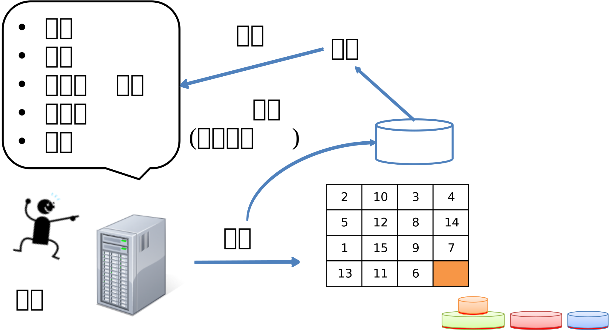{.fig-process .right style="inline-size: 13rem;"}

- 他の問題: 人にも解けて、(既知のアルゴリズムで)コンピューターにも解ける
  * 15パズル、解けない問題もある
  * ハノイの塔

  * 上達すると、**その人にとっての距離**が変わる…  
その人にとっての距離の変化 ∈ **理解**  
…かも

- 言語モデルに「オレオレ詐欺」を解かせる

## 以上{.no-number style="text-align: center; margin-block-start: 3rem;"}
